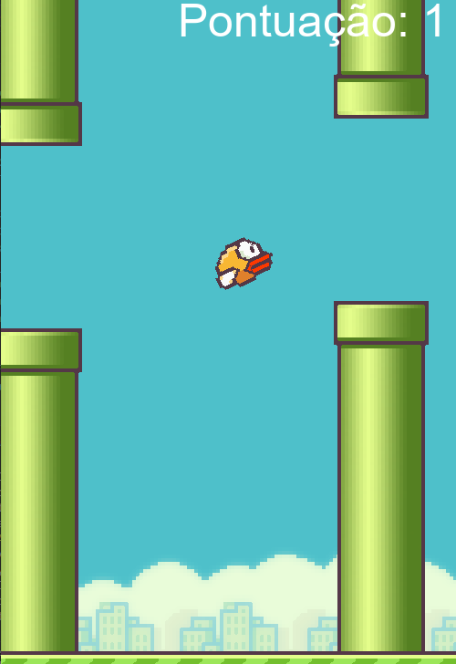

# FlapBirdPY

Este projeto é um clone do famoso jogo Flappy Bird desenvolvido em Python usando a biblioteca Pygame. Foi desenvolvido seguindo a série de 
Criação de Jogos da [Hashtag Programação](https://pages.hashtagtreinamentos.com/).

## Tecnologias utilizadas:

* [Python](https://www.python.org/): linguagem de programação
* [Pygame](https://www.pygame.org/): Biblioteca de Jogos

## Imagem:

<p align="center">
  
</p>

## Como utilizar

1. Clone o repositório:

   ```terminal
   git clone https://github.com/RicardoUbi/FlapBirdPY.git
   
   cd FlapBirdPY

2. Instale a biblioteca:
   
   ```terminal
   pip install pygame

3. Execute o jogo
   
   ```terminal
   python Flapbird.py

### Divirta-se!
   
