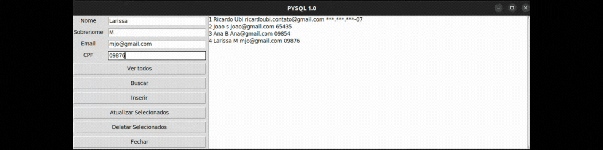
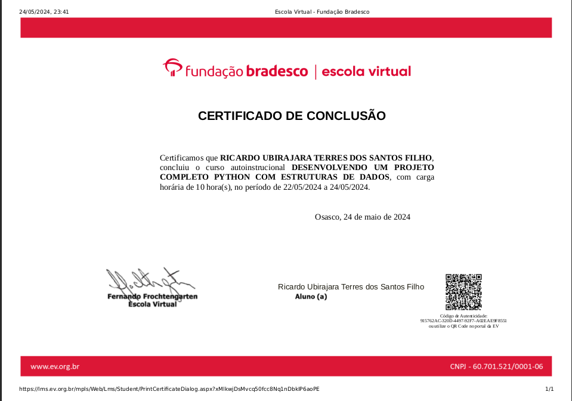

# Python Cadastro Interface

Este é um projeto de estruturas de dados com Interface desenvolvido em Python em conjunto com outras bibliotecas. Foi desenvolvido durante o curso da [Fundação Bradesco](https://www.ev.org.br/cursos/Desenvolvendo-um-Projeto-Completo-Python-com-Estruturas-de-Dados).

Nosso objetivo era fazer a importação de um database para o SQLiteStudio via interface gráfica, criar e manipular tabelas por meio de consultas.
 
## O que o programa faz? 

O programa Busca, Cadastra, Edita e Exclui usuarios, também é possivel visualizar a lista de usuarios.

## Tecnologias utilizadas:

* [Python](https://www.python.org/): linguagem de programação
* [PyInstaller](https://pyinstaller.org/): Biblioteca que transforma arquivos em executavel.
* [Tkinter](https://docs.python.org/pt-br/3/library/tkinter.html): Biblioteca de interface gráfica.

## Demonstração:

<div align="center">
  
</div>

## CERTIFICADO

<div align="center">
  
</div>

## Como utilizar

1. Clone o repositório:

   ```terminal
   git clone https://github.com/RicardoUbi/Python-Collection.git

### Divirta-se!
