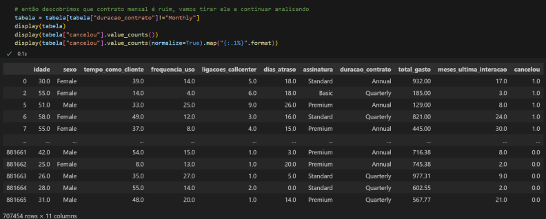
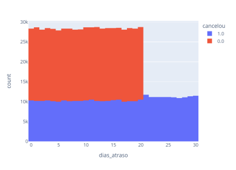
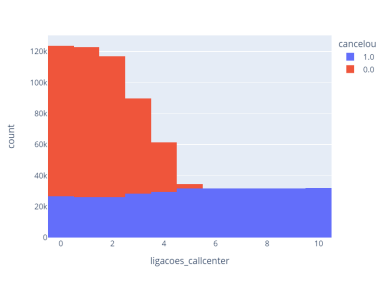

# Python Insights

Este é um projeto de Análise de dados desenvolvido em Python em conjunto com outras bibliotecas. Foi desenvolvido durante o evento Jornada Python da [Hashtag Programação](https://pages.hashtagtreinamentos.com/).

Nosso objetivo era fazer a Análise de Cancelamento de Clientes de uma empresa ficticia.

## O que o programa faz? 

O programa importa uma base de dados em formato .csv, e a partir disso analisamos os dados e geramos graficos.

## Tecnologias utilizadas:

* [Python](https://www.python.org/): linguagem de programação
* [Pandas](https://pandas.pydata.org/): Biblioteca de ferramentas para análise e manipulação de dados
* [Plotly](https://plotly.com/python/): Biblioteca que cria gráficos de alta qualidade
* [Jupyter](https://jupyter.org/): IDE que combina a edição e execução de código com a visualização de resultados,
* [nbformat](https://pypi.org/project/nbformat/): Implemento base para Jupyter


## Imagens:

<div align="center">
  <p>Exportando dados</p>
  

  <p style="margin-top:20px;">Visualindo Graficos</p>
  

  
</div>


## Como utilizar

1. Clone o repositório:

   ```terminal
   git clone https://github.com/RicardoUbi/Python-Collection.git

   cd Python-Collection

   git config core.sparseCheckout true

   echo "Python Insights/" >> .git/info/sparse-checkout

   git pull origin main


2. Instale as bibliotecas:
   
   ```terminal
   # Instale a extensão Jupyter
   pip install pandas
   pip install plotly
   pip install nbformat

3. Execute o programa
   
   Execute pelo Jupyter

### Divirta-se!
   
