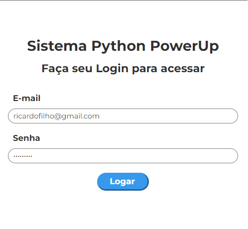

# Python Power

Este é um projeto de automação de tarefas desenvolvido em Python em conjunto com outras bibliotecas. Foi desenvolvido durante o evento Jornada Python da [Hashtag Programação](https://pages.hashtagtreinamentos.com/).

Nosso objetivo era automatizar a tarefa repetitiva de cadastrar produtos no sistema de uma empresa ficticia.

## O que o programa faz? 

O programa entra em um site, faz login e cadastra todos os produtos da planilha de forma automática.

## Tecnologias utilizadas:

* [Python](https://www.python.org/): linguagem de programação
* [Pandas](https://pandas.pydata.org/): Biblioteca de ferramentas para análise e manipulação de dados
* [Pyautogui](https://pyautogui.readthedocs.io/): Biblioteca que permite automatizar tarefas do computador

## Imagens:

<div align="center">
  <p>Fazendo Login de forma automática</p>
  

  <p style="margin-top:20px;">Cadastrando Produtos de forma automática</p>
  

  <p style="margin-top:20px;">Produtos cadastrados</p>
  
</div>


## Como utilizar

1. Clone o repositório:

   ```terminal
   git clone https://github.com/RicardoUbi/Python-Collection.git

   cd Python-Collection

   git config core.sparseCheckout true

   echo "Python Power/" >> .git/info/sparse-checkout

   git pull origin main


2. Instale as bibliotecas:
   
   ```terminal
   pip install pandas
   pip install pyautogui

3. Execute o programa
   
   ```terminal
   python codigo.py

### Divirta-se!
   
