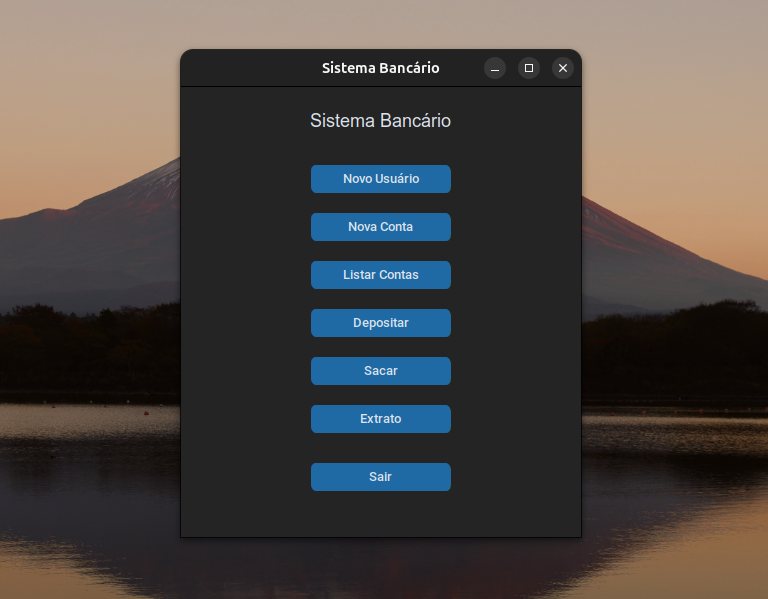
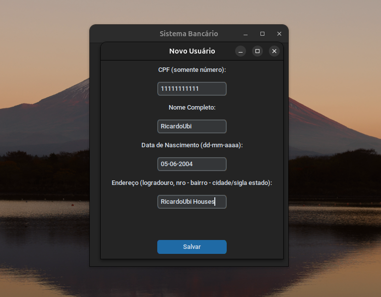
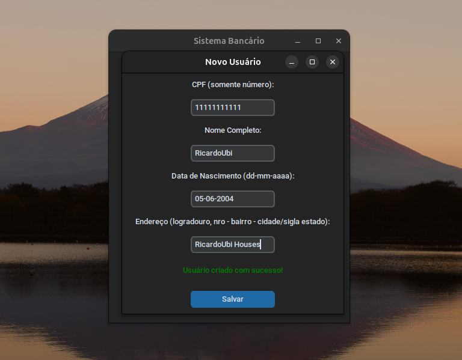
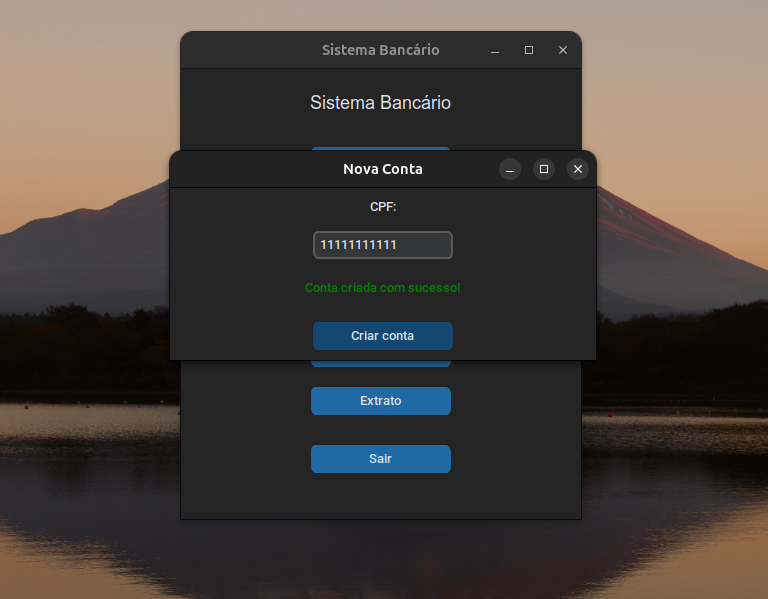
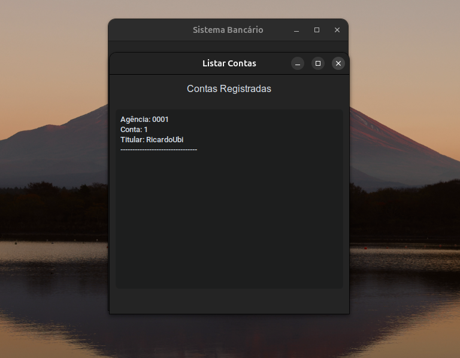
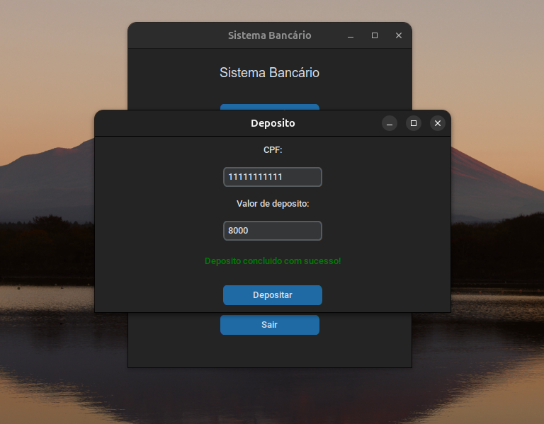
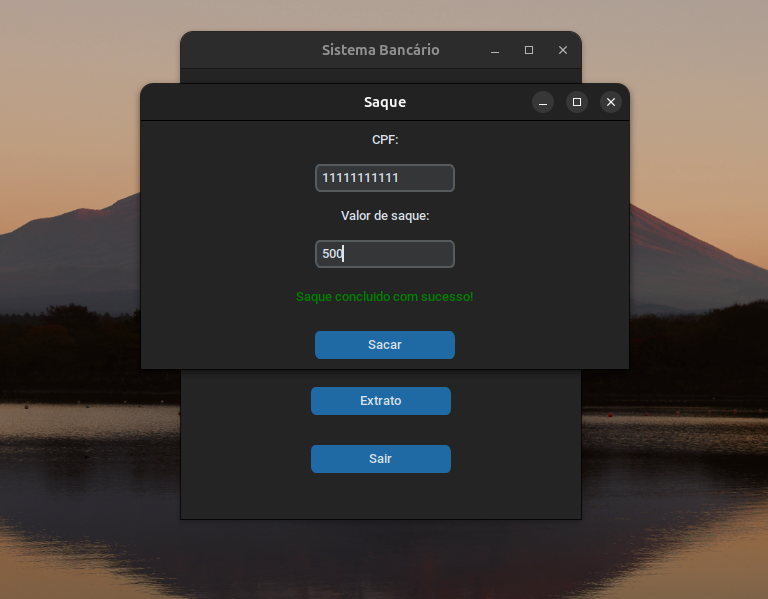
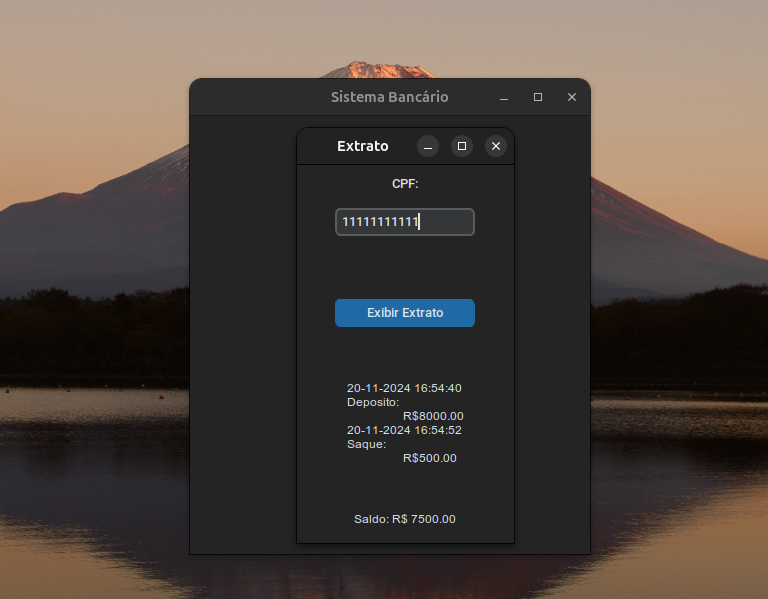

# Python Sistema Bancario

Este é um projeto de sistema bancario com Interface desenvolvido em Python e customTkinter.

O objetivo foi desenvolver um sistema bancario simples utilizando programação orientada a objetos e uma interface grafica com customtkinter.
 
## O que o programa faz? 

O sistema é capaz de:
- Criar usuarios
- Criar contas bancarias, mais de 1 por usuario, se preferir.
- Depositar em contas
- Sacar das contas
- Exibir extrato
- Listar contas

## Tecnologias utilizadas:

* [Python](https://www.python.org/): linguagem de programação
* [customTkinter](https://customtkinter.tomschimansky.com/): Biblioteca de interface gráfica baseada no tkinter.

## Demonstração:

### Pagina inicial
<div align="center">
  
</div>

### Criando usuario
<div align="center">
  
</div>

<div align="center">
  
</div>

### Criando conta
<div align="center">
  
</div>

### Listar contas
<div align="center">
  
</div>

### Depositando na conta
<div align="center">
  
</div>

### Sacando da conta
<div align="center">
  
</div>

### Exibindo extrato da conta
<div align="center">
  
</div>

## Como utilizar

1. Clone o repositório:

   ```terminal
   git clone https://github.com/RicardoUbi/Python-Collection.git

### Divirta-se!
